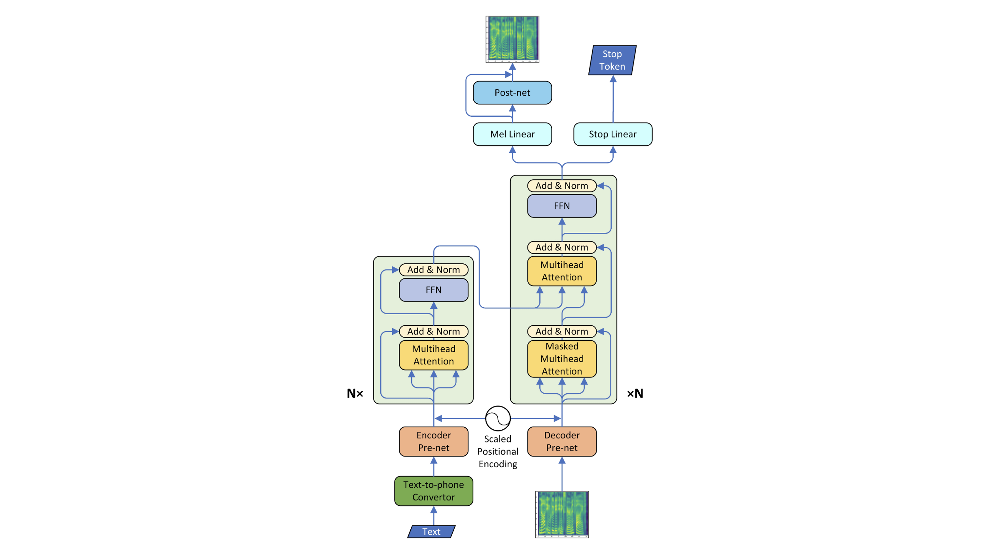

# TransformerTTS - Pytorch Unofficial Implementation

This repository presents an unofficial PyTorch implementation of Transformer-TTS, a neural network-based speech synthesis model that leverages the powerful Transformer architecture. The aim of this project is to explore and reproduce the capabilities of the Transformer-TTS model for converting text into high-quality speech.

<br/>

## 📚 Model Architecture

The core of this project lies in its implementation of the Transformer network, adapted for the task of speech synthesis. The overall model architecture is illustrated below:



<br/>

## 📊 Dataset

This project utilizes the widely recognized LJSpeech dataset for training. LJSpeech is an English speech dataset comprising 13,100 short audio clips from a single speaker, totaling approximately 24 hours of audio. Refer: [The LJ Speech Dataset](https://keithito.com/LJ-Speech-Dataset/)

<br/>

## ✨ Results

Training was performed with a batch size of 16 on the complete LJSpeech dataset for 181 epochs. The current results are visualized through a series of GIFs, demonstrating various aspects of the model's performance during training and initial inference.

### 1. Melspectrogram Prediction

This GIF visually compares the model's predicted melspectrograms against the ground truth melspectrograms, illustrating its ability to generate the target acoustic features.


### 2. Alignment Prediction (Per Batch)

This visualization displays the cross-attention alignments across different samples within a batch (specifically, a batch size of 8 for this visualization). Effective alignment between input text and output speech features is crucial for coherent synthesis.


### 3. Alignment Prediction (Per Layer, Head)

Here, cross-attention alignments are presented per decoder layer and per attention head. This offers insights into how different parts of the Transformer learn to attend to relevant parts of the input sequence, which is vital for proper sequence-to-sequence mapping.


### 4. Inference Challenges

During training, a teacher forcing method was employed. While this approach significantly accelerates training by allowing parallel processing of decoder inputs, it often leads to a discrepancy between training and inference performance. As observed in the initial experiments, direct inference results without teacher forcing were notably poor. This is a common challenge, where the model becomes overly reliant on correct past tokens during training and struggles when generating tokens sequentially without such guidance during inference.


<br/>

## ⚙️ Dependencies

This project was developed and tested with the following key dependencies:

```text
torch                            2.2.0
torchaudio                       2.2.0
lightning                        2.5.2
librosa                          0.11.0
numpy                            1.26.3
loguru                           0.7.3
g2p-en                           2.7.0
python                           3.10.13
```

It is recommended to set up your environment using the specified Docker container or ensure you have these exact versions installed. This project was developed based on the Docker container `pytorch/pytorch:2.2.0-cuda11.8-cudnn8-devel`.

<br/>

## 📝 Notes on Training Environment

The model was trained using a single `NVIDIA RTX 4060` GPU. Due to VRAM limitations, it was challenging to significantly increase the batch size beyond 16. (I tried to use gradient accumulation). It's important to note that the original authors of Transformer-TTS suggest using a batch size larger than 64 to achieve more stable alignments and overall better performance. Future work will explore strategies such as gradient accumulation or distributed training to overcome this limitation.

<br/>

## 📖 References

This implementation is inspired by and based on the following research paper:

- Li, N., Liu, S., Liu, Y., Zhao, S., & Liu, M. (2019, July). Neural speech synthesis with transformer network. In Proceedings of the AAAI conference on artificial intelligence (Vol. 33, No. 01, pp. 6706-6713).

<br/>

## 🛣️ Future Work

The primary focus for future development is to address the current challenges with inference quality. This includes:

- Implementing scheduled teacher forcing to gradually transition the model from ground truth to its own predicted inputs during training, which can improve generalization during inference.

- Experimenting with larger effective batch sizes (e.g., via gradient accumulation) to achieve more stable alignments, as suggested by the original paper.

- Exploring other regularization techniques and training strategies to enhance the model's ability to generalize to unseen data.

<br/>

## 🙏 Acknowledgements

I'd like to extend my sincere gratitude to Keith Ito for providing the excellent LJSpeech dataset, which was instrumental in this project. Additionally, I am deeply thankful to Nan Li, Sheng Liu, Yu Liu, Shiyu Zhao, and Ming Liu, the authors of the original "Neural Speech Synthesis with Transformer Network" paper, for their foundational work that inspired and guided this implementation.
