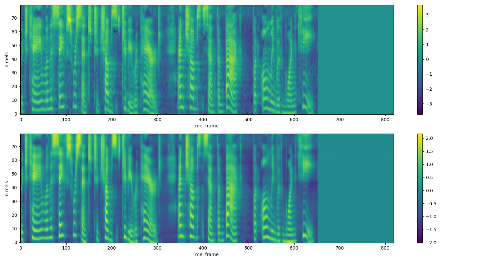

# TransformerTTS

A PyTorch implementation of **Transformer-TTS**, a neural network-based speech synthesis model leveraging the Transformer Network. This unofficial repository uses **teacher forcing** for training. Currently I'm addressing challenges in inference by experimenting with techniques like **teacher forcing ratio adjustment** and **pseudo-label training**.

<br>

## Model Architecture


The architecture follows the Transformer-TTS model design proposed in the reference paper. It employs self-attention mechanisms to effectively learn the mapping from text to mel-spectrograms.

<br>

## Dataset

The [LJSpeech dataset](https://keithito.com/LJ-Speech-Dataset/) is used for training. You can download the dataset manually or through the `torchaudio` library. Organize the dataset as follows:

```
|- data
  |- wavs/
  |- metadata.csv
```

For more details, refer to the [torchaudio dataset documentation](https://pytorch.org/audio/stable/datasets.html).

<br>

## Vocoder

This repository uses **HiFi-GAN** as the vocoder, integrated with [kan-bayashi's parallel wavegan](https://github.com/kan-bayashi/ParallelWaveGAN). Ensure the following files are downloaded and placed in the `vocoder` directory:

```
|- vocoder
  |- checkpoint-2500000steps.pkl
  |- config.yml
  |- mu.npy
  |- var.npy
```

<br>

## Installation & Training

Follow these steps to set up and train the model:

1. Install dependencies:
   ```bash
   pip install -r requirements.txt
   ```

2. Start training with configurable parameters:
   ```bash
   python train.py -m config/model_config.yml -p config/preprocess_config.yml -t config/train_config.yml
   ```

Modify the configuration files to adjust model and preprocessing parameters as needed.

<br>

## Training Results

The model was trained on 13,100 audio samples with a batch size of 32 for 10 epochs. Below is a comparison of the ground-truth and predicted mel-spectrograms after **35,000 steps**:



<br>

## References

Li, N., Liu, S., Liu, Y., Zhao, S., & Liu, M. (2019, July). Neural speech synthesis with transformer network. In *Proceedings of the AAAI Conference on Artificial Intelligence* (Vol. 33, No. 01, pp. 6706-6713). [Read the paper](https://arxiv.org/abs/1809.08895)